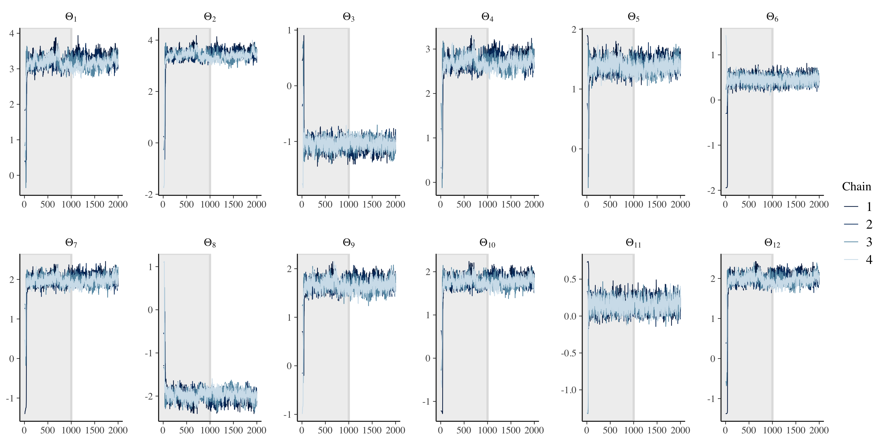
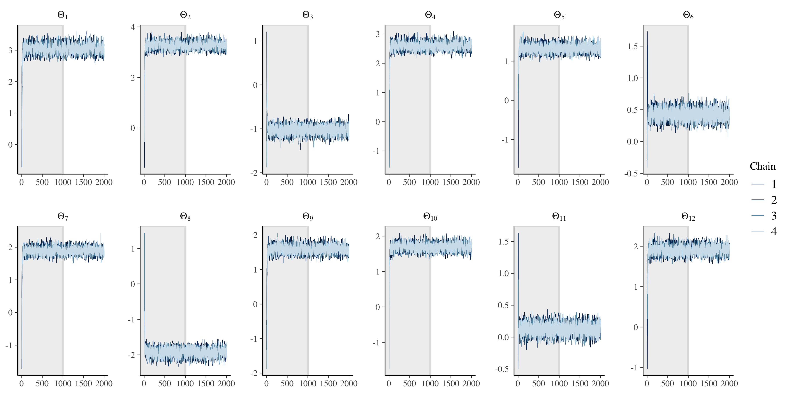
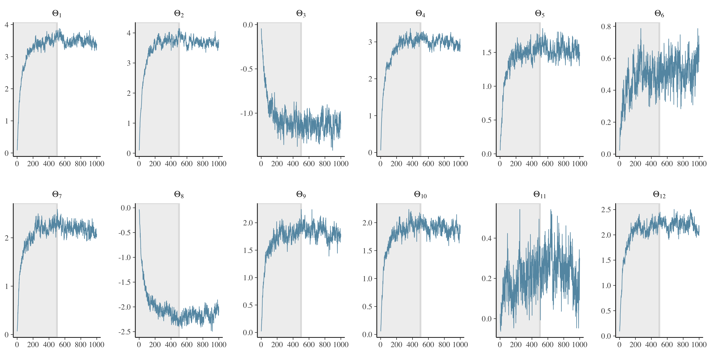
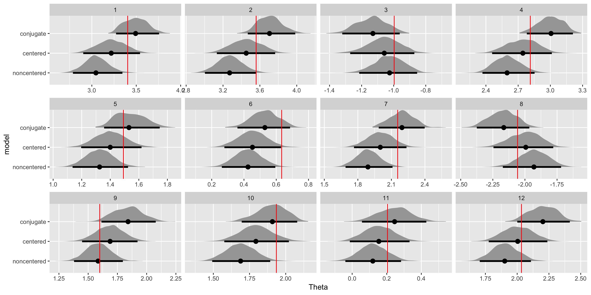

Choice models are common in marketing and other applications where researchers are interested in understanding both the drivers and trade-offs of choice. Since choice is typically manifest as a non-binary discrete outcome, and we care about modeling consumer heterogeneity, a hierarchical Bayesian multinomial logit model is our default specification.

In marketing, choice models are often employed in conjunction with conjoint experiments, a survey-based approach to eliciting preferences where respondents choose from sets of hypothetical product alternatives. Because the conjoint experiment produces repeat observations at the respondent level, [the groups in the hierarchical model](https://www.occasionaldivergences.com/post/stan-hierarchical/) are the respondents themselves.

The goal of this post is to answer two questions with respect to choice models. First, does it matter if we use a non-centered parameterization for a hierarchical multinomial logit model? We have previously explored using a [non-centered parameterization](https://www.occasionaldivergences.com/post/non-centered/) for hierarchical regression and even argued that a non-centered parameterization should be our default approach in most applications. Second, how does using Hamilton Monte Carlo (HMC) via [Stan](https://mc-stan.org) for estimation compare to using random-walk Metropolis Hastings Markov chain Monte Carlo (MCMC), which is still the go-to estimation procedure for choice modeling in practice?

To answer these questions, we will compare the specification and performance of three parameterizations of the hierarchical multinomial logit model: a centered parameterization which uses HMC, a non-centered parameterization which uses HMC, and what we will call a conjugate parameterization which uses MCMC.

## Centered parameterization

- Start by explaining the process of a conjoint experiment.
- Employ and explain specification for computational efficiency.

```{stan hmnl-centered, output.var="hmnl_centered", eval=FALSE}

```

Generate data...

```{stan generate-data, output.var="generate_data", eval=FALSE}

```

```{r centered-calibration, eval=FALSE}
# Set the seed.
set.seed(42)

N <- 500          # Number of respondents.
S <- 10           # Number of choice tasks per respondent.
P <- 4            # Number of alternatives per choice task.
L <- 12           # Number of (estimable) attribute levels.
C <- 1            # Number of covariates.

# True Theta (C x L) values and Sigma (L x L) values.
Theta <- matrix(runif(C * L, -3, 4), byrow = FALSE, nrow = C, ncol = L)
Sigma <- diag(L) + .5 * matrix(1, nrow = L, ncol = 1) %*% t(matrix(1, nrow = L, ncol = 1))

# Generate Y, X, Z, and Beta.
Y <- matrix(NA, nrow = N, ncol = S)
X <- array(NA, dim = c(N, S, P, L))
Z <- matrix(NA, nrow = N, ncol = C)
Beta <- matrix(NA, nrow = N, ncol = L)
Y_list = X_list <- NULL
for (n in 1:N) {
  # Generate covariates for the distribution of heterogeneity.
  Z[n, 1] <- 1
  if (C > 1) Z[n, -1] <- c(z_temp, round(runif(C - 1)))
  
  # Generate individual-level betas.
  Beta[n,] <- mvtnorm::rmvnorm(1, mean=t(Theta) %*% Z[n,], sigma = Sigma)
  
  # Compute the latent utility a scenario at a time.
  X_temp <- NULL
  for (s in 1:S) {
    # Generate or draw the design matrix for the given scenario.
    X[n, s,,] <- matrix(round(runif(P * L)), nrow = P, ncol = L)
    
    # Compute and the latent utility for each alternative and find the max.
    U <- X[n, s,,] %*% Beta[n,] + matrix((-log(-log(runif(P)))), ncol = 1)
    Y[n, s] <- which(U == max(U))
    
    # Save out each design matrix as a list.
    X_temp <- rbind(X_temp, X[n, s,,])
  }
  
  # Also save out each respondent's data as a list.
  Y_list[[n]] <- Y[n,]
  X_list[[n]] <- X_temp
}

sim_data <- list(
  Y = Y,
  X = X,
  Z = Z,
  Y_list = Y_list,
  X_list = X_list,
  Theta = Theta,
  Sigma = Sigma,
  Beta = Beta
)
```

Run the model...

```{r, eval = FALSE}
# Load packages.
library(tidyverse)
library(rstan)

# Set Stan options.
rstan_options(auto_write = TRUE)
options(mc.cores = parallel::detectCores())

# Load simulated data.
sim_data <- read_rds(here::here("Data", "hmnl_sim_data.RDS"))

# Indicate the model to run.
hmnl_conjugate <- 1
hmnl_centered <- 0
hmnl_noncentered <- 0

# MCMC Conjugate Parameterization -----------------------------------------
if (hmnl_conjugate == 1) {
  # Specify the data for calibration in a list.
  Data = list(
    N = nrow(sim_data$Y),    # Number of respondents.
    S = ncol(sim_data$Y),    # Number of choice tasks per respondent.
    P = dim(sim_data$X)[3],  # Number of product alternatives per choice task.
    L = dim(sim_data$X)[4],  # Number of (estimable) attribute levels.
    C = ncol(sim_data$Z),    # Number of respondent-level covariates.
    
    y = sim_data$Y_list,     # List of choices.
    X = sim_data$X_list,     # List of design matrices.
    Z = sim_data$Z           # Covariates for the upper-level model.
  )
  
  # Specify the prior for calibration in a list.
  Prior = list(
    gammabar = matrix(rep(0, Data$C * Data$L), ncol = Data$L), # Means for normal prior on Gamma.
    Agamma = 0.01 * diag(Data$C),                              # Precision matrix for normal prior on Gamma.
    nu = Data$L + 3,                                           # DF for IW prior on Vbeta.
    V = (Data$L + 3) * diag(Data$L)                            # Location for IW prior on Vbeta.
  )
  
  # Specify the MCMC parameters in a list.
  Mcmc = list(
    R = 10000,               # Number of iterations in the Markov chain.
    keep = 10,               # Thinning parameter.
    step = .08,              # RW step (scaling factor) for the beta draws.
    cont_ind = 0             # Indicates a run continuation.
  )
  
  # Calibrate the model.
  source(here::here("Code", "hmnl-conjugate_estimate.R"))
  fit <- hier_mnl(Data, Prior, Mcmc)
  
  # Save model output.
  write_rds(fit, here::here("Output", "hmnl-conjugate_fit.RDS"))
}

# HMC Centered Parameterization -------------------------------------------
if (hmnl_centered == 1) {
  # Specify the data for calibration in a list.
  data <- list(
    N = nrow(sim_data$Y),    # Number of respondents.
    S = ncol(sim_data$Y),    # Number of choice tasks per respondent.
    P = dim(sim_data$X)[3],  # Number of product alternatives per choice task.
    L = dim(sim_data$X)[4],  # Number of (estimable) attribute levels.
    C = ncol(sim_data$Z),    # Number of respondent-level covariates.
    
    Theta_mean = 0,          # Mean of coefficients for the heterogeneity model.
    Theta_scale = 10,        # Scale of coefficients for the heterogeneity model.
    tau_mean = 0,            # Mean of scale parameters for the heterogeneity model.
    tau_scale = 2.5,         # Scale of scale parameters for the heterogeneity model.
    Omega_shape = 2,         # Shape of correlation matrix for the heterogeneity model.
    
    Y = sim_data$Y,          # Matrix of observed choices.
    X = sim_data$X,          # Array of experimental designs per choice task.
    Z = sim_data$Z           # Matrix of respondent-level covariates.
  )
  
  # Calibrate the model.
  fit <- stan(
    file = here::here("Code", "hmnl-centered_estimate.stan"),
    data = data,
    seed = 42
  )
  
  # Save model output.
  write_rds(fit, here::here("Output", "hmnl-centered_fit.RDS"))
}

# HMC Non-Centered Parameterization ---------------------------------------
if (hmnl_noncentered == 1) {
  # Specify the data for calibration in a list.
  data <- list(
    N = nrow(sim_data$Y),    # Number of respondents.
    S = ncol(sim_data$Y),    # Number of choice tasks per respondent.
    P = dim(sim_data$X)[3],  # Number of product alternatives per choice task.
    L = dim(sim_data$X)[4],  # Number of (estimable) attribute levels.
    C = ncol(sim_data$Z),    # Number of respondent-level covariates.
    
    Theta_mean = 0,          # Mean of coefficients for the heterogeneity model.
    Theta_scale = 1,         # Scale of coefficients for the heterogeneity model.
    alpha_mean = 0,          # Mean of scale for the heterogeneity model.
    alpha_scale = 10,        # Scale of scale for the heterogeneity model.
    lkj_corr_shape = 5,      # Shape of correlation matrix for the heterogeneity model.
    
    Y = sim_data$Y,          # Matrix of observed choices.
    X = sim_data$X,          # Array of experimental designs per choice task.
    Z = sim_data$Z           # Matrix of respondent-level covariates.
  )
  
  # Calibrate the model.
  fit <- stan(
    file = here::here("Code", "hmnl-noncentered_estimate.stan"),
    data = data,
    seed = 42
  )
  
  # Save model output.
  write_rds(fit, here::here("Output", "hmnl-noncentered_fit.RDS"))
}
```

Results and parameter recovery...

There are no divergences and the traceplots look reasonable. The model ran for 2,000 iterations.



## Non-centered parameterization

```{stan, output.var = "example", eval = FALSE}
// Data values, hyperparameters, observed choices, and the experimental design.
data {
  int<lower = 1> N;                  // Number of respondents.
  int<lower = 1> S;                  // Number of choice tasks per respondent.
  int<lower = 2> P;                  // Number of product alternatives per choice task.
  int<lower = 1> L;                  // Number of (estimable) attribute levels.
  int<lower = 1> C;                  // Number of respondent-level covariates.
  
  real Theta_mean;                   // Mean of coefficients for the heterogeneity model.
  real<lower=0> Theta_scale;         // Scale of coefficients for the heterogeneity model.
  real alpha_mean;                   // Mean of scale for the heterogeneity model.
  real<lower=0> alpha_scale;         // Scale of scale for the heterogeneity model.
  real<lower=0> lkj_corr_shape;      // Shape of correlation matrix for the heterogeneity model.
  
  int<lower = 1, upper = P> Y[N, S]; // Matrix of observed choices.
  matrix[P, L] X[N, S];              // Array of experimental designs per choice task.
  matrix[N, C] Z;                    // Matrix of respondent-level covariates.
}

// Parameters for the hierarchical multinomial logit.
parameters {
  matrix[L, C] Theta;                        // Matrix of coefficients for the heterogeneity model.
  vector<lower=0, upper=pi()/2>[L] tau_unif; // Initialized parameter value for a Cauchy draw.
  cholesky_factor_corr[L] L_Omega;           // Cholesky factorization for heterogeneity covariance.
  matrix[L, N] alpha;                        // Standard deviations for heterogeneity covariance.
}

// Deterministically transformed parameter values.
transformed parameters {
  matrix[N, L] Beta;                              // Matrix of Beta coefficients.
  vector<lower=0>[L] tau;                         // Scale for heterogeneity covariance.
  for (l in 1:L) tau[l] = 2.5 * tan(tau_unif[l]); // Inverse probability Cauchy draw.
  
  // Draw of Beta following non-centered parameterization.
  Beta = Z * Theta' + (diag_pre_multiply(tau,L_Omega) * alpha)';
}

// Hierarchical multinomial logit model.
model {
  // Hyperpriors on Theta, alpha, and L_Omega (and thus Sigma).
  to_vector(Theta) ~ normal(Theta_mean, Theta_scale);
  to_vector(alpha) ~ normal(alpha_mean, alpha_scale);
  L_Omega ~ lkj_corr_cholesky(lkj_corr_shape);

  // Hierarchical multinomial logit.
  for (n in 1:N) {
    for (s in 1:S) {
      Y[n, s] ~ categorical_logit(X[n, s] * Beta[n,]');
    }
  }
}
```

Run the model...

Results and parameter recovery...

There are no divergences and the traceplots indicate good mixing. The model ran for 2,000 iterations.



## Conjugate parameterization

The multivariate normal distribution of heterogeneity covariance matrix has a conjugate Inverse-Wishart for the choice model using MCMC. For both of the HMC parameterizations, an LKJ/Cauchy prior is used instead.

```{r, eval = FALSE}
hier_mnl = function (Data, Prior, Mcmc, Cont) {
  # This function implements an MCMC estimation algorithm for a hierarchical MNL with a multivariate 
  # normal distribution of heterogeneity.
  
  # Describe and Assign Function Arguments ----------------------------------
  # Data = list(y,X,Z,Beta,Gamma).
  y = Data$y                                              # List of choices.
  X = Data$X                                              # List of design matrices.
  Z = Data$Z                                              # Covariates for the upper-level model.
  
  # Prior = list(gammabar,Agamma,nu,V).
  gammabar = Prior$gammabar                               # Means for normal prior on Gamma.
  Agamma = Prior$Agamma                                   # Precision matrix for normal prior on Gamma.
  nu = Prior$nu                                           # DF for IW prior on Vbeta.
  V = Prior$V                                             # Location for IW prior on Vbeta.
  
  # Mcmc = list(R,keep,step,sim_ind,cont_ind).
  R = Mcmc$R                                              # Number of iterations in the Markov chain.
  keep = Mcmc$keep                                        # Thinning parameter.
  step = Mcmc$step                                        # RW step (scaling factor) for the beta draws.
  cont_ind = Mcmc$cont_ind                                # Indicates a run continuation.
  
  # Choice variables.
  nresp = length(y)                                       # Number of respondents.
  nvars = ncol(X[[1]])                                    # Number of attribute levels.
  nscns = length(y[[1]])                                  # Number of choice tasks.
  nalts = length(X[[1]][,1])/nscns                        # Number of alternatives in each choice task.
  ncovs = ncol(Z)                                         # Number of covariates.
  
  # Describe and Initialize Function Output ---------------------------------
  # Respondent-level parameter draws.
  betadraw = array(double(floor(R/keep)*nresp*nvars),dim=c(nresp,nvars,floor(R/keep)))
  
  # Aggregate-level parameter draws.
  Gammadraw = matrix(double(floor(R/keep)*nvars*ncovs),ncol=nvars*ncovs)
  Vbetadraw = matrix(double(floor(R/keep)*nvars*nvars),ncol=nvars*nvars)
  
  # Diagnostic draws and initial clock time.
  llikedraw = double(floor(R/keep))     # Log likelihood.
  acceptdraw = array(0,dim=c(R/keep))   # Beta acceptance rate.
  stepdraw = array(0,dim=c(R/keep))     # RW step adjusted during burn-in.
  itime = proc.time()[3]                # Initial clock time.
  
  # Initialize MCMC ---------------------------------------------------------
  cat("MCMC Iteration (estimated time to end in hours | step | beta accept | llike )",fill=TRUE)
  
  # Initialize values.
  if (cont_ind == 0) {
    step = Mcmc$step
    oldbetas = matrix(double(nresp*nvars),ncol=nvars)
    oldGamma = matrix(double(nvars*ncovs),ncol=nvars)
    oldVbeta = diag(nvars)
  }
  
  # Initialize values and use the previous draws for continued runs.
  if (cont_ind == 1) {
    step = Cont$out_step
    oldbetas = Cont$out_oldbetas
    oldGamma = matrix(Cont$out_oldGamma,ncol=nvars)
    oldVbeta = Cont$out_oldVbeta
  }
  
  # Log-likelihood function for the MNL.
  ll_mnl <- function (beta, y, X) {
    nvars = ncol(X)        # Number of attribute levels.
    nscns = length(y)      # Number of choice tasks.
    nalts = nrow(X)/nscns  # Number of alternatives.
    
    # Compute Xbeta across all choice tasks.
    Xbeta = matrix(exp(X%*%beta),byrow=TRUE,ncol=nalts)
    
    # Numerator: Xbeta values associated with each choice.
    choices = cbind(c(1:nscns),y)
    numerator = Xbeta[choices]
    
    # Denominator: Xbeta values associated with each task.
    iota = c(rep(1,nalts))
    denominator = Xbeta%*%iota
    
    # Return the logit summed across choice tasks.
    return(sum(log(numerator) - log(denominator)))
  }
  
  # Run the MCMC ------------------------------------------------------------
  # The Markov chain will run for R iterations.
  for (r in 1:R) {
    loglike = 0   # Initialize log likelihood values for each iteration r.
    naccept = 0   # Initialize number of times the new beta draws are accepted.
    
    # Respondent-level loop.
    for (resp in 1:nresp) {
      # Draw beta (random walk).
      beta_old = oldbetas[resp,]
      if (r < (R/3)) beta_can = as.vector(rmvnorm(1,mean=beta_old,sigma=(step*oldVbeta)))
      if (r >= (R/3)) beta_can = as.vector(rmvnorm(1,mean=beta_old,sigma=(step*Vbeta_fixed)))
      
      # Log likelihood with old and candidate beta draws.
      log_old = ll_mnl(beta_old,y[[resp]],X[[resp]])
      log_can = ll_mnl(beta_can,y[[resp]],X[[resp]])
      
      # Log of the MVN distribution of heterogeneity.
      log_heter_old = dmvnorm(beta_old,mean=Z[resp,]%*%oldGamma,sigma=oldVbeta,log=TRUE)
      log_heter_can = dmvnorm(beta_can,mean=Z[resp,]%*%oldGamma,sigma=oldVbeta,log=TRUE)
      
      # Compare the old and candidate posteriors and compute alpha (second-stage prior and proposal densities cancel out.)
      diff = exp((log_can + log_heter_can) - (log_old + log_heter_old))
      if (diff == "NaN" || diff == Inf) {
        alpha = -1 # If the number doesn't exist, always reject.
      } else {
        alpha = min(1,diff)
      }
      unif = runif(1)
      if (unif < alpha) {
        oldbetas[resp,] = beta_can
        naccept = naccept + 1
        loglike = loglike + log_can
      } else {
        loglike = loglike + log_old
      }
    }
    
    # Draw Gamma and Vbeta (Gibbs step).
    out = rmultireg(oldbetas,Z,gammabar,Agamma,nu,V)
    oldGamma = out$B
    oldVbeta = out$Sigma
    
    # Fix Vbeta for post-burn-in beta proposal density.
    if (r == floor(R/3)) Vbeta_fixed = oldVbeta
    
    # Houskeeping and Output --------------------------------------------------
    # Modify the RW step sizes to constrain acceptance rates in batches of 100 during burn-in (R/3).
    if (r%%100 == 0 & cont_ind == 0) {
      if (r < (R/3)) {
        # Update step.
        if (naccept/nresp < .20) {
          step = step*0.95
        }
        if (naccept/nresp > .60) {
          step = step*1.05
        }
      }
    }
    
    # Print progress.
    if (r%%5 == 0) {
      ctime = proc.time()[3]
      timetoend = ((ctime - itime)/r)*(R - r)
      bacceptr=naccept/nresp
      cat(" ",r," (",round((timetoend/60)/60,2),"|",round(step,5),"|",round(bacceptr,2),"|",round(loglike,2),")",fill = TRUE)
    }
    
    # Print chart less often.
    if (r%%100 == 0) {
      par(mfrow=c(2,1))
      plot(llikedraw,type="l"); matplot(Gammadraw,type="l")
    }
    
    # Save the posterior draws.
    mkeep = r/keep
    if (mkeep*keep == (floor(mkeep)*keep)) {
      betadraw[,,mkeep] = oldbetas
      Gammadraw[mkeep,] = as.vector(oldGamma)
      Vbetadraw[mkeep,] = as.vector(oldVbeta)
      llikedraw[mkeep] = loglike
      acceptdraw[mkeep] = naccept/nresp
      stepdraw[mkeep] = step
    }
    
    # Save out continuation files.
    if (r%%R == 0) {
      Cont = list(out_oldbetas = betadraw[,,R/keep],out_oldGamma = matrix(Gammadraw[R/keep,],byrow=TRUE,ncol=(nvars*ncovs)),
           out_oldVbeta = matrix(Vbetadraw[R/keep,],byrow=TRUE,ncol=nvars),out_step = step)
    }
  }
  
  # Print total run time.
  ctime = proc.time()[3]
  cat(" Total Time Elapsed (in Hours): ",round(((ctime - itime)/60)/60,2),fill = TRUE)
  
  # Output.
  return(list(betadraw=betadraw,Gammadraw=Gammadraw,Vbetadraw=Vbetadraw,
    llikedraw=llikedraw,acceptdraw=acceptdraw,stepdraw=stepdraw,Cont=Cont))
}
```

Run the model...

Results and parameter recovery...

We can't evaluate diverges and the traceplots look fair, though they have taken far longer to converge in the warm-up iterations. Note we only have a single chain and we had to run the model for 20,000 iterations.



## Comparison

- MCMC Conjugate Parameterization: Total Time Elapsed (in Hours):  1.49
- HMC Centered Parameterization: 4036.11 seconds (Total)

```{r}
4036.11 / 60
```

- HMC Non-Centered Parameterization: 1858.35 seconds (Total)

```{r}
1858.35 / 60
```

Here we compare the marginal posteriors for each of the three specifications.



The true values for each of the marginal posteriors is in red. The 95% credible interval is drawn below each posterior. Our of the 12 parameters, the MCMC recovers the true value 11 times, the HMC centered parameterization also recovers the true value 11 times, and the HMC non-centered parameterization recovers the true value only 7 times.

## Final thoughts

Thus it appears that while the non-centered parameterization is faster, the centered parameterization does a better job. That said, this is for a single simulated dataset.

-----

### Marc Dotson

Marc is an assistant professor of marketing at the BYU Marriott School of Business. He graduated with an MSc from The London School of Economics and Political Science in 2009 and a PhD from The Ohio State University in 2016. His research interests include Bayesian inference, predictive modeling, consumer preference heterogeneity, and unstructured data. Marc teaches marketing analytics. You can find him on [Twitter](https://twitter.com/marcdotson) and [GitHub](https://github.com/marcdotson).
