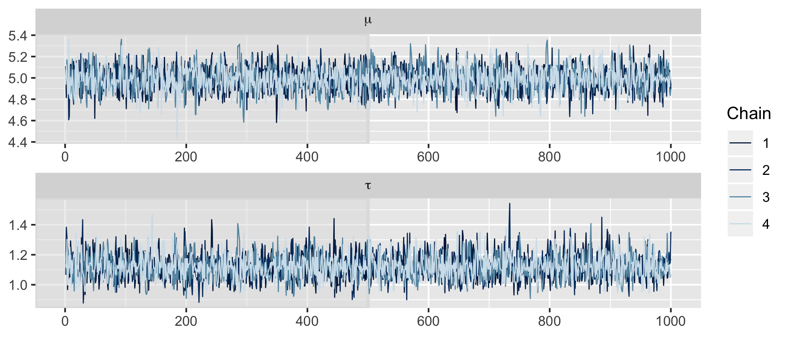

Bayesian inference provides an intuitive and self-consistent approach to [statistical modeling](https://betanalpha.github.io/assets/case_studies/modeling_and_inference.html). In short, you have beliefs about unobserved values (e.g., the impact of price on customer satisfaction) and you use data to update those beliefs. The barrier to using Bayesian inference in practice has never been this intuition -- it's been the [required computation](https://arxiv.org/abs/1701.02434). There has been a great deal of progress on this front, with [Stan](https://mc-stan.org) arguably providing the best solution.

Stan is a probabilistic programming language that provides a general-purpose sampler using Hamiltonian Monte Carlo. In other words, Stan automates the required computation (for many models), allowing you to conduct Bayesian inference by just focusing on model building. This is especially powerful when it comes to utilizing the mainstay of Bayesian inference: hierarchical models.

The goal of this post is to provide a gentle introduction to building hierarchical models in Stan. We will be interfacing with Stan through R and will be adopting a [tidy approach](https://www.tidyverse.org) whenever appropriate. This post does not provide a general introduction to Bayesian inference in Stan. For that, I recommend Michael Betancourt's [case studies](https://betanalpha.github.io/writing/), [Probabilistic Modeling and Statistical Inference](https://betanalpha.github.io/assets/case_studies/modeling_and_inference.html) in particular, and Richard McElreath's [*Statistical Rethinking*](https://github.com/rmcelreath/rethinking). Much of what follows is motivated by their work.

## Simple regression

Let's start with a simple (non-hierarchical) regression. In a Stan script, which [has native support in RStudio](https://blog.rstudio.com/2018/10/16/rstudio-1-2-preview-stan/), we specify the three required blocks for a Stan model: `data`, `parameters`, and `model` (i.e., the prior and the likelihood).

```{stan regression, output.var = "regression", eval = FALSE}
// Index value and observations.
data {
  int<lower = 1> N;  // Number of individuals.
  vector[N] y;       // Vector of observations.
}

// Parameters.
parameters {
  real mu;           // Mean of the regression.
  real<lower=0> tau; // Variance of the regression.
}

// Simple regression.
model {
  // Priors.
  mu ~ normal(0, 5);
  tau ~ cauchy(0, 2.5);

  // Likelihood.
  y ~ normal(mu, tau);
}
```

Imagine this is a model of customer satisfaction where we have `N` individuals, a vector of overall satisfaction `y` with a single observation from each individual, and we are assuming that satisfaction `y` is distributed `normal`, with a single mean `mu` and variance `tau` to describe customer satisfaction in the population. Finally, our joint model is complete with a `normal` prior on `mu` and a `cauchy` prior on `tau`.

Like all Bayesian models, this model is generative, so we can also use Stan to generate data according to some assumed parameter values and then use the generated data to test the model, including demonstrating parameter recovery. To do this, we reorganize these three blocks into `data` (which now includes the assumed parameter values as data) and `generated quantities` blocks (which now includes the observations that will be generated).

```{stan generate-data, output.var = "generate_data", eval = FALSE}
// Index and parameter values.
data {
  int<lower = 1> N;  // Number of observations.
  real mu;           // Mean of the regression.
  real<lower=0> tau; // Variance of the regression.
}

// Generate data according to the simple regression.
generated quantities {
  vector[N] y;       // Vector of observations.

  // Generate data.
  for (n in 1:N) {
    y[n] = normal_rng(mu, tau);
  }
}
```

The for loop over `y` in the `generated quantities` block emphasizes the strong assumption of this non-hierarchical model that a single mean `mu` and variance `tau` describe customer satisfaction in the population. If this doesn't sit well with you, a hierarchical model will provide the cure. We'll return to this shortly.

In an R script, let's load the necessary packages, allow Stan to use as many cores as we have available, specify assumed parameter values, and generate data according to our simple regression.

```{r simulation, eval = FALSE}
# Load packages.
library(tidyverse)
library(rstan)
library(bayesplot)
library(tidybayes)

# Set Stan options.
options(mc.cores = parallel::detectCores())

# Specify data and parameter values.
sim_values <- list(
  N = 100, # Number of observations.
  mu = 5,  # Mean of the regression.
  tau = 1  # Variance of the regression.
)

# Generate data.
sim_data <- stan(
  file = here::here("code", "generate_data.stan"),
  data = sim_values,
  iter = 1,
  chains = 1,
  seed = 42,
  algorithm = "Fixed_param"
)

# Extract simulated data.
sim_y <- extract(sim_data)$y
```

To test our model, we simply specify the generated data inputs as a list of data, call the regression model from R, and Stan does all the heavy lifting for us.

```{r model-calibration, eval = FALSE}
# Specify data.
data <- list(
  N = length(sim_y),   # Number of individuals.
  y = as.vector(sim_y) # Vector of observations.
)

# Calibrate the model.
fit <- stan(
  file = here::here("code", "regression.stan"),
  data = data,
  seed = 42
)
```

Note that we aren't calling `generate_data.stan`. That was simply to generate data. Now we're calling `regression.stan` to actually estimate the model. Stan takes those three required blocks and creates a Hamiltonian Monte Carlo sampler to produce draws from the posterior.

Once the model has finished running, we can check diagnostics, including checking for divergences, which are a key indicator of problems with the sampler that are unique to Hamiltonian Monte Carlo.

```{r diagnostics, eval = FALSE}
# Diagnostics.
source(here::here("code", "stan_utility.R"))
check_all_diagnostics(fit)
```

```
[1] "n_eff / iter looks reasonable for all parameters"
[1] "Rhat looks reasonable for all parameters"
[1] "0 of 4000 iterations ended with a divergence (0%)"
[1] "0 of 4000 iterations saturated the maximum tree depth of 10 (0%)"
[1] "E-FMI indicated no pathological behavior"
```

The diagnostics check out! To be thorough, we can also check the trace plots.

```{r trace-plots, eval = FALSE}
# Check trace plots.
fit %>%
  mcmc_trace(
    pars = c("mu", "tau"),
    n_warmup = 500,
    facet_args = list(nrow = 2, labeller = label_parsed)
  )
```



As suggested by the `Rhat` diagnostic, we have good mixing and clear convergence across chains for both of our model parameters. Finally, we can demonstrate parameter recovery by plotting the marginal posteriors for our parameter values to confirm that the assumed parameter values used when generating data are within the 95% credible intervals.

```{r marginals, eval = FALSE}
# Recover parameter values.
par_values <- tibble(
  .variable = c("mu", "tau"),
  values = c(sim_values$mu, sim_values$tau),
)

fit %>%
  gather_draws(mu, tau) %>%
  ggplot(aes(x = .value, y = .variable)) +
  geom_halfeyeh(.width = .95) +
  facet_wrap(
    ~ .variable,
    nrow = 2,
    scales = "free"
  ) +
  geom_vline(aes(xintercept = values), par_values, color = "red")
```


The assumed parameter values have been recovered by the model! In summary, we've generated data and demonstrated that the model is working as intended.

## Simple hierarchical regression

So why move to a hierarchical model? The most straightforward reason is that sinking feeling we have about the assumption that a single set of parameters will effectively describe the entire population. In terms of customer satisfaction, we know there is heterogeneity across consumers -- not everyone behaves or thinks the same. At the very least, we can think about satisfaction being different for different customer segments.

So what does a hierarchical model look like in Stan?

```{stan hierarchical-regression-01, output.var = "hierarchical_regression_01", eval = FALSE}
// Index values and observations.
data {
  int<lower = 1> N;               // Number of individuals.
  int<lower = 1> K;               // Number of groups.
  vector[N] y;                    // Vector of observations.
  int<lower = 1, upper = K> g[N]; // Vector of group assignments.
}

// Parameters and hyperparameters.
parameters {
  vector[K] beta;                 // Vector of group intercepts.
  real mu;                        // Mean of the population model.
  real<lower=0> tau;              // Variance of the population model.
}

// Hierarchical regression.
model {
  // Hyperpriors.
  mu ~ normal(0, 5);
  tau ~ cauchy(0, 2.5);

  // Population model and likelihood.
  beta ~ normal(mu, tau);
  for (n in 1:N) {
    y[n] ~ normal(beta[g[n]], 1);
  }
}
```

In the `data` block, we now have a vector `g` indicating which one of `K` groups each of our `N` individuals belong to. In the `parameter` block, we now have `K`-dimensional vector of `beta` parameters, a separate mean for each of the `K` of groups. In the `model` block we can see that the likelihood (now within a for loop) is still assumed `normal`, but now each observed overall satisfaction has a mean of `beta` specific to the group they belong to. We also have a population model `beta ~ normal(mu, tau)` that says these separate, group-level `beta` coefficients are themselves drawn from a population that is assumed `normal` with a mean `mu` and variance `tau`. This is what we mean by a hierarchy: there is an additional level in our model, the lower-level likelihood and upper-level population model. Finally, our joint model is complete with a prior on the population model parameters (formally referred to as hyperpriors, since they are a prior on a prior): a `normal` hyperprior on `mu` and a `cauchy` hyperprior on `tau`.

We can again translate this into `data` and `generated quantities` blocks to use Stan to generate data for us.

```{stan generate-data-01, output.var = "generate_data_01", eval = FALSE}
// Index and hyperparameter values.
data {
  int<lower = 1> N;               // Number of individuals.
  int<lower = 1> K;               // Number of groups.
  int<lower = 1, upper = K> g[N]; // Vector of group assignments.
  real mu;                        // Mean of the population model.
  real<lower=0> tau;              // Variance of the population model.
}

// Generate data according to the hierarchical regression.
generated quantities {
  vector[N] y;                    // Vector of observations.
  vector[K] beta;                 // Vector of group intercepts.

  // Assign to a group, draw parameter values, generate data.
  for (k in 1:K) {
    beta[k] = normal_rng(mu, tau);
  }
  for (n in 1:N) {
    y[n] = normal_rng(beta[g[n]], 1);
  }
}
```

Let's generate data according this hierarchical model by calling the Stan script from R.

```{r simulation-01, eval = FALSE}
# Specify data and hyperparameter values.
sim_values <- list(
  N = 100,                            # Number of individuals.
  K = 3,                              # Number of groups.
  g = sample(3, 100, replace = TRUE), # Vector of group assignments.
  mu = 5,                             # Mean of the population model.
  tau = 1                             # Variance of the population model.
)

# Generate data.
sim_data <- stan(
  file = here::here("code", "generate_data_01.stan"),
  data = sim_values,
  iter = 1,
  chains = 1,
  seed = 42,
  algorithm = "Fixed_param"
)

# Extract simulated data and group intercepts.
sim_y <- extract(sim_data)$y
sim_beta <- extract(sim_data)$beta
```

We can test our simple hierarchical model using our new generated data and call the hierarchical model model from R.

```{r model-calibration-01, eval = FALSE}
# Specify data.
data <- list(
  N = length(sim_y),    # Number of individuals.
  K = sim_values$K,     # Number of groups.
  y = as.vector(sim_y), # Vector of observations.
  g = sim_values$g      # Vector of group assignments.
)

# Calibrate the model.
fit <- stan(
  file = here::here("code", "hierarchical_regression_01.stan"),
  data = data,
  seed = 42
)
```

```
Warning messages:
1: There were 6 divergent transitions after warmup. Increasing adapt_delta above 0.8 may help. See
http://mc-stan.org/misc/warnings.html#divergent-transitions-after-warmup 
2: Examine the pairs() plot to diagnose sampling problems
```

Remember our divergences diagnostic? We have a simple hierarchical model and already our Hamiltonian Monte Carlo diagnostic has identified an issue. There is a [good reason for these divergences](https://arxiv.org/abs/1312.0906), but the short story is hierarchical models have posteriors with geometry that is difficult to navigate. This is true independent of the sampler, but it's quickly evident when using Hamiltonian Monte Carlo.

To address this issue, we need to reparameterize our hierarchical model such that the posterior geometry is easier to navigate. Such reparameterizations are called known as non-centered.

```{stan hierarchical-regression-01b, output.var = "hierarchical_regression_01b", eval = FALSE}
// Index values and observations.
data {
  int<lower = 1> N;               // Number of individuals.
  int<lower = 1> K;               // Number of groups.
  vector[N] y;                    // Vector of observations.
  int<lower = 1, upper = K> g[N]; // Vector of group assignments.
}

// Parameters and hyperparameters.
parameters {
  // vector[K] beta;                 // Vector of group intercepts.
  vector[K] var_beta;                 // Vector of group intercepts.
  real mu;                        // Mean of the population model.
  real<lower=0> tau;              // Variance of the population model.
}

// Non-centered parameterization.
transformed parameters {
  vector[K] beta;                 // Vector of group intercepts.
  for (k in 1:K) {
    beta[k] = tau * var_beta[k] + mu;
  }
}

// Hierarchical regression.
model {
  // Hyperpriors.
  var_beta ~ normal(0, 1);
  mu ~ normal(0, 5);
  tau ~ cauchy(0, 2.5);

  // Population model and likelihood.
  beta ~ normal(mu, tau);
  for (n in 1:N) {
    y[n] ~ normal(beta[g[n]], 1);
  }
}
```

## Multiple hierarchical regression


## Final thoughts

Hierarchical models should be our default approach in most applications and Stan removes the barriers to entry for Bayesian computation. However, there are behaviors inherent to hierarchical models that make them somewhat problematic to implement in Stan. This can provide a frustrating mismatch: Providing a way into Bayesian inference only to pull it away again.

The correlations induced within a hierarchical model change the geometry sufficiently as to make their estimation via Hamiltonian Monte Carlo more challenging than the geometry of an aggregate model. Don't throw the baby out with the bathwater -- these same problems exist for other samplers as well, though they might not be as obvious, and HMC promises to still provide a more efficient and complete sampling of the posterior distribution as long as we know how to navigate their implementation.

- Partial pooling (like shrinking, adaptively between an aggregate model and separate models, which helps avoid overfitting).
- Estimate both individual and population parameters simultaneously.
- Include information in the form of covariates at both individual and population levels.
